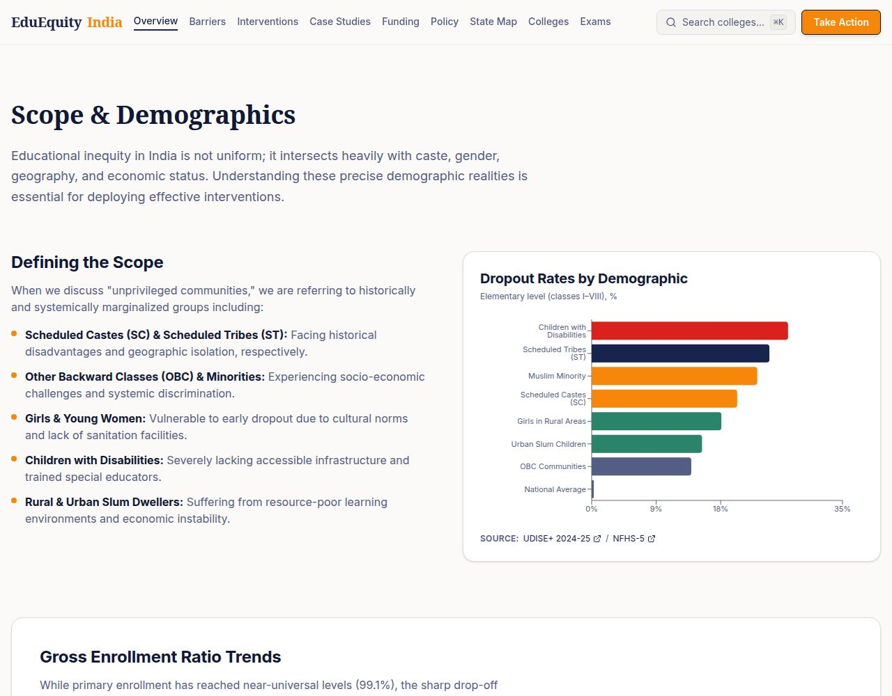

# EduEquity India

### Every child’s right to learn is India’s path to progress.

An interactive education-equity dashboard that makes barriers to learning in India easier to explore. EduEquity India brings education indicators, demographic context, state-level insights, and action-oriented resources together in one place.

**[Open the live demo →](https://edu-india-hub--sharmarahulkuma.replit.app)**  
Browse the [overview dashboard](https://edu-india-hub--sharmarahulkuma.replit.app/overview), [India map](https://edu-india-hub--sharmarahulkuma.replit.app/india-map), or [institution search](https://edu-india-hub--sharmarahulkuma.replit.app/institutions).

## Dashboard preview

<a href="https://edu-india-hub--sharmarahulkuma.replit.app/overview">
  
</a>

## What you can explore

- **Education indicators:** Review enrollment and dropout trends, with source references shown alongside the data.
- **Demographic context:** Explore how barriers affect communities differently, including Scheduled Castes and Tribes, girls, children with disabilities, and rural learners.
- **State-level insights:** Compare education indicators across India using the state map and statistics.
- **Research and responses:** Browse barriers, interventions, case studies, funding mechanisms, and policy recommendations.
- **Ways to take action:** Search colleges and exams, and find ways to get involved.

## About the project

Educational disadvantage is shaped by more than access to a school. Geography, household resources, gender, disability, and historical exclusion all affect whether children can enroll, attend, and continue learning. This project brings those factors into a single, accessible experience so students, educators, researchers, and community organizations can move from data to informed action.

The dashboard presents its sources next to relevant visualizations—for example, the overview references UDISE+ 2024–25 and NFHS-5—so readers can trace the context behind the indicators.

## Technology

- React, TypeScript, and Vite
- Express API service
- PNPM workspace

## Run and build

This repository is a PNPM workspace with separate web and API services.

```bash
pnpm install
pnpm run build
```

For development, run the API and web services in separate terminals:

```bash
pnpm --filter @workspace/api-server run dev
pnpm --filter @workspace/edu-india run dev
```

The app expects API requests under `/api`. The Replit workspace routes these to the API service; when running outside Replit, configure a local reverse proxy for `/api` to reach the API server.